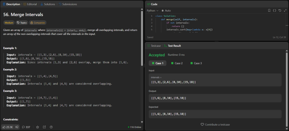
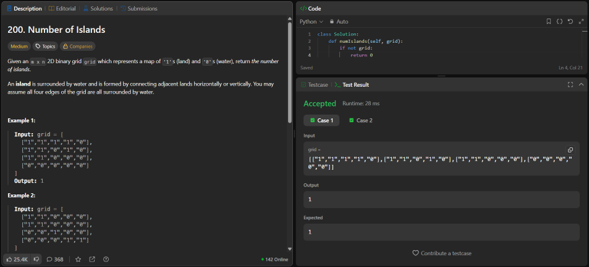
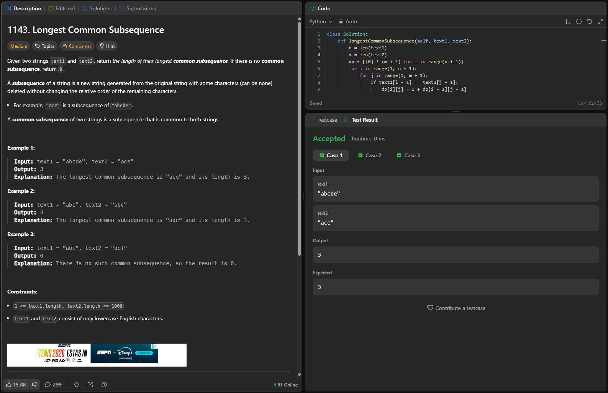
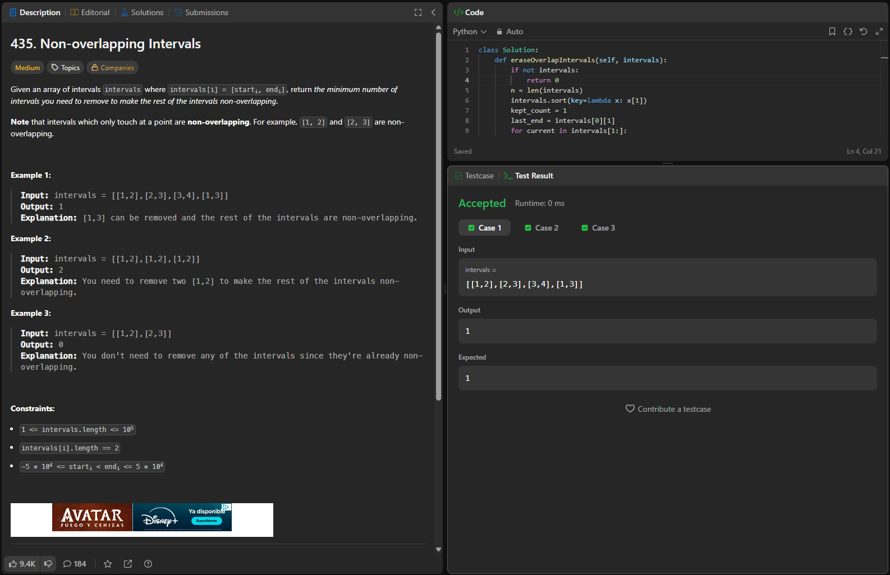
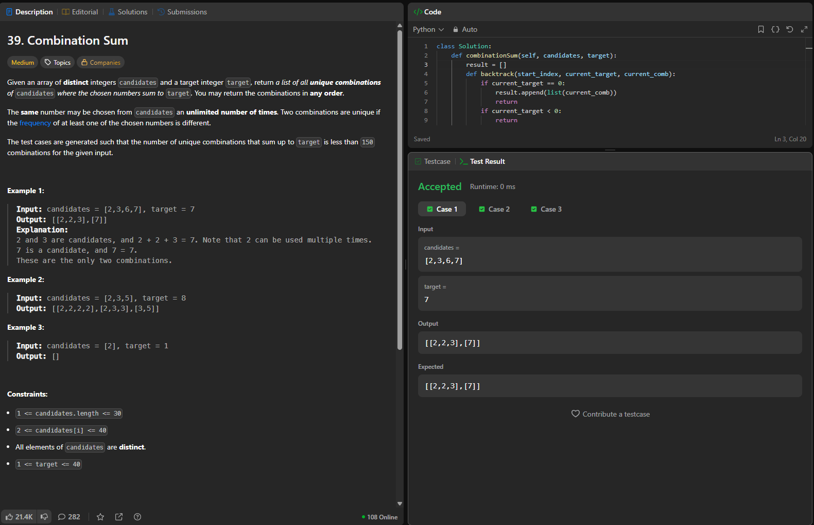

## 56. Merge Intervales

## Familia:
Ordenamiento.

## Idea: 
Para este punto del taller, la clave fue plantear la solución utilizando el algoritmo de ordenamiento. La idea central es ordenar primero la lista de intervalos de menor a mayor tomando como referencia su punto de inicio; al tenerlos ordenados, el criterio local consiste en recorrerlos secuencialmente y comparar el inicio del intervalo actual con el final del último intervalo guardado: si se solapan, elijo fusionarlos actualizando el límite final, y si no, añado el intervalo actual como un nuevo elemento independiente.Para este punto del taller, la clave fue plantear la solución utilizando el algoritmo de ordenamiento. La idea central es ordenar primero la lista de intervalos de menor a mayor tomando como referencia su punto de inicio; al tenerlos ordenados, el criterio local consiste en recorrerlos secuencialmente y comparar el inicio del intervalo actual con el final del último intervalo guardado: si se solapan, elijo fusionarlos actualizando el límite final, y si no, añado el intervalo actual como un nuevo elemento independiente.

## Complejidad:
Complejidad de Tiempo: O(n log n), donde n es la cantidad total de intervalos en la entrada. El algoritmo de ordenamiento inicial es el proceso más costoso y el que domina el tiempo de ejecución, ya que el ciclo posterior donde recorro y fusiono los arreglos se hace en un tiempo lineal de O(n).
Complejidad de Espacio: O(n), donde n es el número de intervalos. Este espacio es el que necesito para la lista resultante donde voy almacenando los elementos definitivos (que en el peor de los casos, si no hay solapamientos, serán los mismos n elementos) y por el espacio de memoria auxiliar que utiliza el método de ordenamiento del lenguaje.

## Link:

## 200. Number of Islands

## Familia:
Grafos.

## Idea: 
La idea es contar el número de componentes conexas del grafo. Para esto, recorro toda la matriz celda por celda; cada vez que encuentro un '1' que no he visitado, sé que encontré una nueva isla, así que sumo 1 a mi contador. Inmediatamente lanzo una Búsqueda en Profundidad (DFS) desde esa celda para recorrer toda la isla y "hundirla" (marco cada celda contigua reemplazando el '1' por '0'). De esta manera, me aseguro de que el DFS marque toda la componente conexa y no la vuelva a contar en el recorrido principal.

## Complejidad:
Complejidad de Tiempo: $\Theta\$(m x n), donde $m$ son las filas y n las columnas de la grilla. Aunque hay llamados recursivos del DFS, cada celda de la matriz se procesa (se visita y se marca) un número constante de veces a lo sumo, por lo que el tiempo de ejecución crece de forma estrictamente proporcional al tamaño total de la grilla.
Complejidad de Espacio: O(m x n). Este es el espacio que necesito en el peor de los casos para la pila de llamadas (call stack) de la recursividad del DFS. Esto ocurriría en un escenario extremo donde toda la matriz fuera pura tierra formando un solo camino en zigzag, haciendo que el DFS se anide m x n veces.

## Link:

## 1143. Longest Common Subsequence

## Familia:
Programación dinámica.

## Idea: 
Para este problema, utilicé un enfoque de programación dinámica tabular (bottom-up), evitando la recursión pura para no caer en tiempos exponenciales. La idea es construir la solución a partir de los prefijos de las cadenas.

## Complejidad:
Complejidad de Tiempo: $\Theta\$(n x m), donde n es la longitud de text1 y m es la longitud de text2. Esto se debe a que utilizo dos ciclos anidados para llenar cada una de las celdas de la matriz exactamente una vez, y la operación dentro de los ciclos toma un tiempo constante O(1).
Complejidad de Espacio: $\Theta\$(n x m), que es el espacio que ocupo en memoria para almacenar toda la matriz bidimensional. Cabe mencionar que, dado que para calcular la fila actual solo dependo de la fila inmediatamente anterior, este espacio se podría llegar a comprimir a $\Theta\$(min(n, m)) utilizando un arreglo de dos filas, pero para la legibilidad de la tabulación completa mantuve la matriz de tamaño n x m.

## Link:

## 435. Non-overlapping Intervals

## Familia:
Greedy.

## Idea: 
Para este ejercicio, modelé el problema como una selección de actividades. En lugar de pensar directamente en cuáles intervalos borrar, me enfoqué en maximizar cuántos intervalos puedo conservar sin que se solapen.

## Complejidad:
Complejidad de Tiempo: O(n log n), donde n es la cantidad de intervalos. Un enfoque de programación dinámica comparando todos contra todos tomaría O(n^2), pero con este criterio greedy el paso que domina el tiempo es el ordenamiento inicial (sort). Después de ordenar, hacer la elección óptima solo requiere una única pasada lineal de O(n).
Complejidad de Espacio: O(n) en el peor de los casos. Aunque la lógica de selección solo utiliza variables extra que toman espacio constante O(1), el algoritmo de ordenamiento interno de Python (Timsort) puede requerir hasta O(n) de memoria adicional auxiliar para realizar las copias y mezclas de las corridas.

## Link:

## 39. Combination Sum

## Familia:
Backtracking.

## Idea: 
Para este ejercicio evité el enfoque de Programación Dinámica (como el O(n * target) de Coin Change), ya que mi objetivo no es encontrar un mínimo, sino enumerar de forma exhaustiva las combinaciones válidas. El estado de mi búsqueda en cada llamado recursivo está definido por: el índice desde el cual tengo permitido tomar números, el objetivo restante (target actual) y la combinación que he construido hasta el momento.

## Complejidad:
Complejidad de Tiempo: O(n^(t / min)), donde $n$ es la cantidad de candidatos, t es el target original, y min es el valor más pequeño dentro del arreglo de candidatos. En el peor caso, el árbol de recursión tiene una profundidad máxima de t / min (ej. si el target es 8 y el mínimo es 2, el árbol baja 4 niveles sumando [2,2,2,2]), y en cada nivel el ciclo itera hasta $n$ veces. Por tanto, es un algoritmo de tiempo exponencial propio del backtracking.
Complejidad de Espacio: O(t / \min) por el espacio ocupado por la pila de llamadas (call stack) en la recursión y por el arreglo temporal current_comb, más el espacio de memoria adicional que requiere la lista final de salida para almacenar todas las respuestas encontradas.

## Link:

